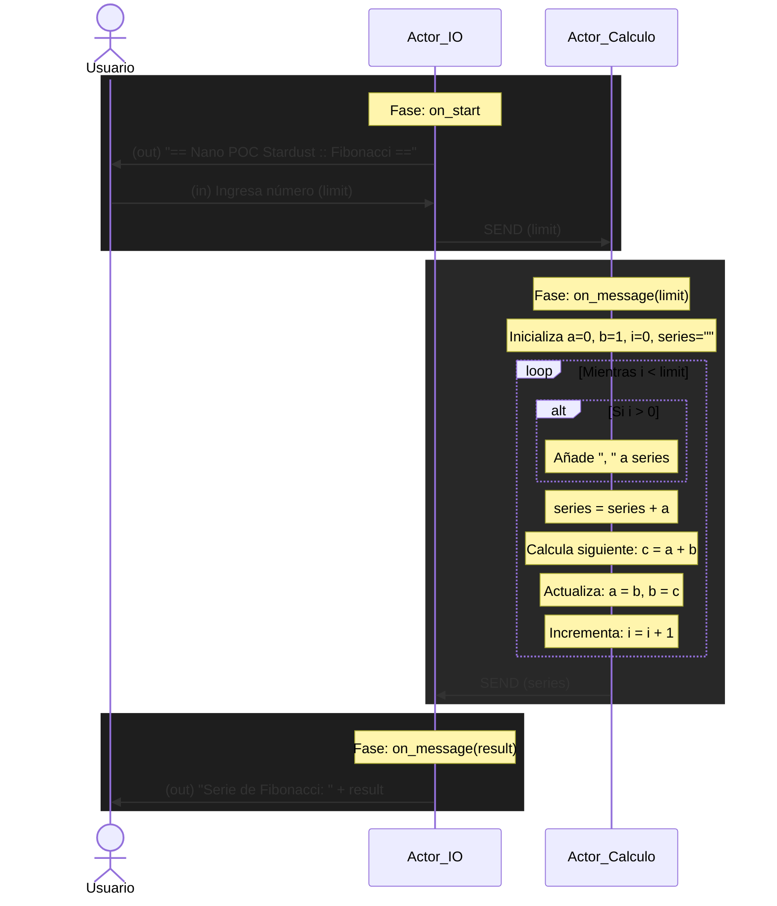
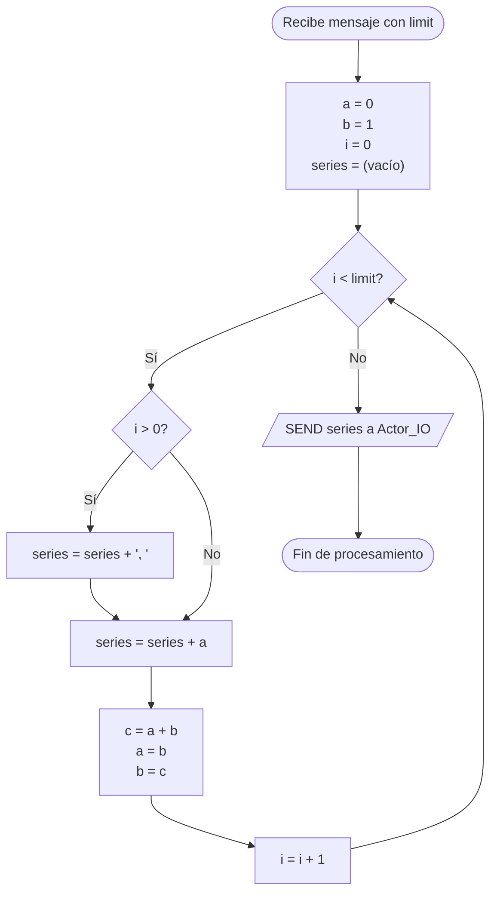

```mermaid
sequenceDiagram
    actor Usuario
    participant IO as Actor_IO
    participant Calc as Actor_Calculo

    rect rgb(30, 30, 30)
    Note over IO: Fase: on_start
    IO->>Usuario: (out) "== Nano POC Stardust :: Fibonacci =="
    Usuario->>IO: (in) Ingresa número (limit)
    IO->>Calc: SEND (limit)
    end

    rect rgb(40, 40, 40)
    Note over Calc: Fase: on_message(limit)
    Note over Calc: Inicializa a=0, b=1, i=0, series=""
    
    loop Mientras i < limit
        alt Si i > 0
            Note over Calc: Añade ", " a series
        end
        Note over Calc: series = series + a
        Note over Calc: Calcula siguiente: c = a + b
        Note over Calc: Actualiza: a = b, b = c
        Note over Calc: Incrementa: i = i + 1
    end
    
    Calc->>IO: SEND (series)
    end

    rect rgb(30, 30, 30)
    Note over IO: Fase: on_message(result)
    IO->>Usuario: (out) "Serie de Fibonacci: " + result
    end
```

```mermaid
flowchart TD
    Start([Recibe mensaje con limit]) --> Init
    Init["a = 0<br>b = 1<br>i = 0<br>series = (vacío)"] --> EvalLoop
    
    EvalLoop{"i < limit?"}
    EvalLoop -- Sí --> CheckFirst{"i > 0?"}
    
    CheckFirst -- Sí --> AddComma["series = series + ', '"]
    CheckFirst -- No --> AppendA
    
    AddComma --> AppendA
    AppendA["series = series + a"] --> Math["c = a + b<br>a = b<br>b = c"]
    Math --> Inc["i = i + 1"]
    Inc --> EvalLoop
    
    EvalLoop -- No --> SendBack[/"SEND series a Actor_IO"/]
    SendBack --> End([Fin de procesamiento])
```